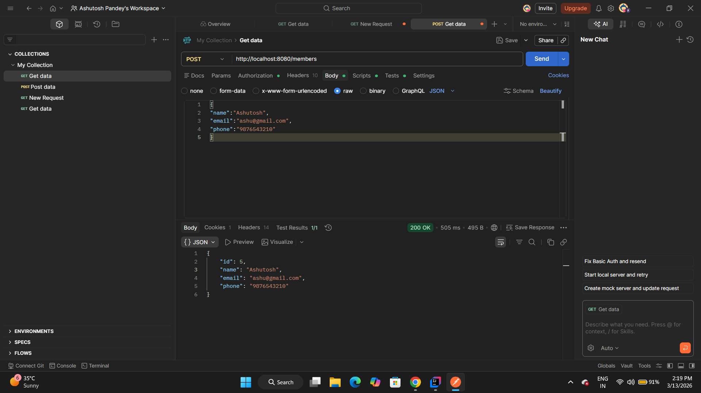
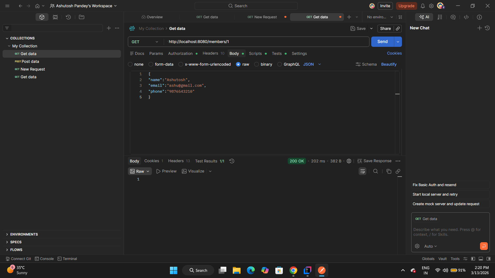
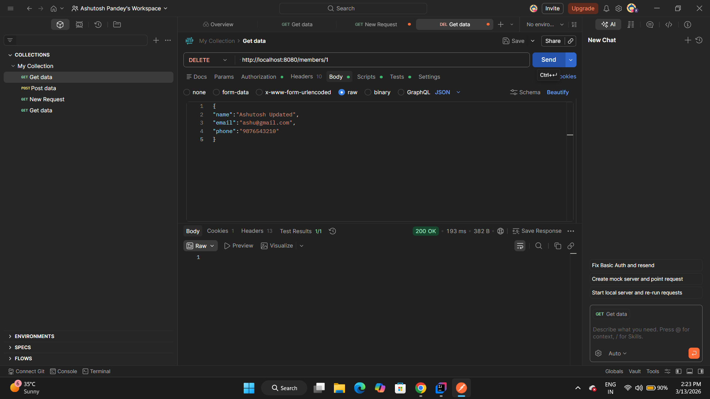
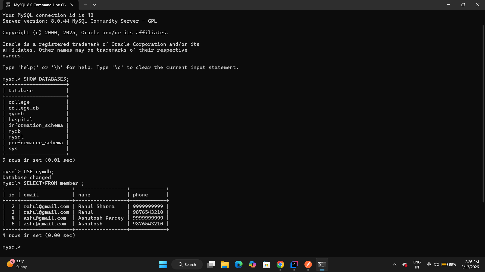

# Gym Management Backend System

A RESTful backend system built using Java and Spring Boot to manage gym members, trainers, and subscriptions.  
This project demonstrates backend architecture used in real-world startup applications.

---

## Tech Stack

- Java 17
- Spring Boot
- Spring Data JPA
- MySQL
- Spring Security
- Maven
- REST APIs

---

## Architecture

The project follows **Layered Architecture** used in modern backend systems.

Controller Layer → Handles API requests  
Service Layer → Business logic  
Repository Layer → Database operations  

This structure helps maintain **clean, scalable, and maintainable code**.

---

## Features

- CRUD APIs for Gym Members
- Pagination support for scalable APIs
- Search APIs
- MySQL database integration
- Layered backend architecture
- RESTful API design
- Exception handling
- Basic authentication using Spring Security

---

## API Endpoints

### Create Member

POST /members

Example Request

```
{
"name": "Ashutosh",
"email": "ashu@gmail.com",
"phone": "9876543210"
}
```

---

### Get Member by ID

GET /members/{id}

---

### Get Members with Pagination

GET /members?page=0&size=5

---

### Update Member

PUT /members/{id}

---

### Delete Member

DELETE /members/{id}

---

## API Screenshots

### Create Member API


### Get Member By ID


### Pagination API


### Update Member API


### Delete Member API


### Database Table

