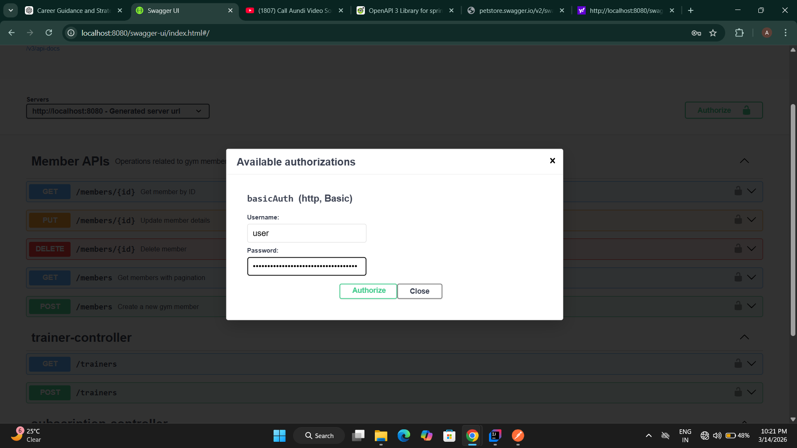
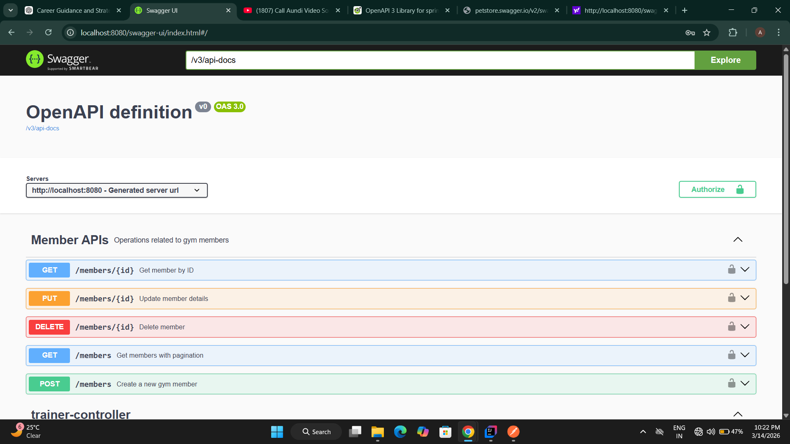
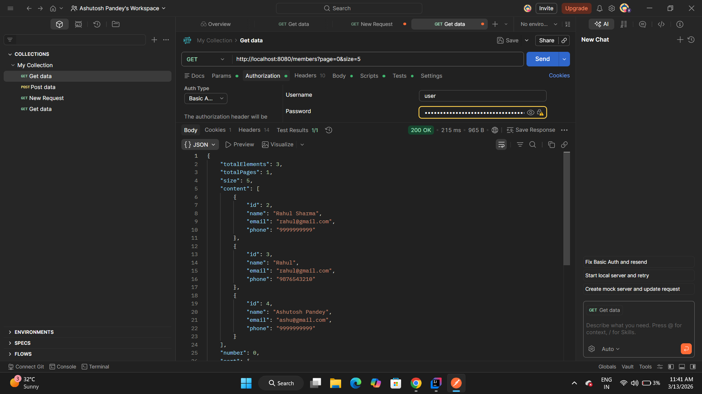
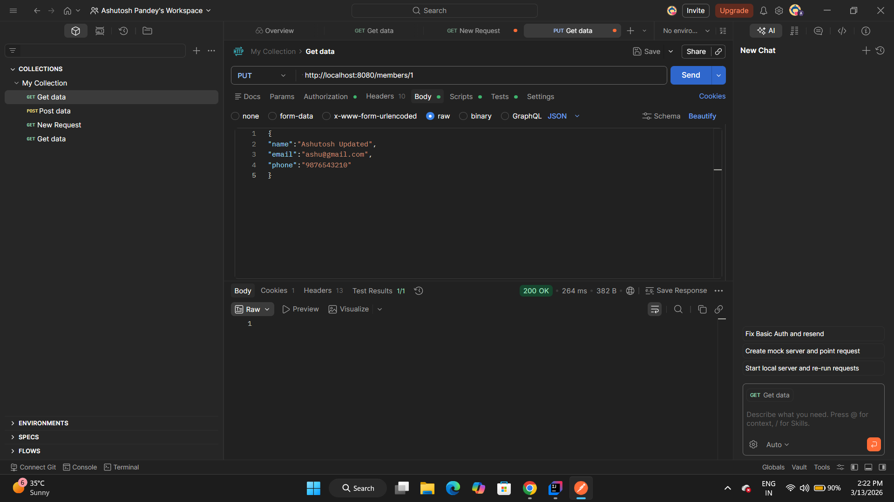

# Gym Management Backend System

A **RESTful backend system** built using Java and Spring Boot to manage gym members.
This project demonstrates backend architecture used in real-world applications including API design, database integration, security, and documentation.

---

## Tech Stack

* Java 17
* Spring Boot
* Spring Data JPA
* MySQL
* Spring Security
* Swagger (OpenAPI)
* Maven
* REST APIs

---

## Backend Architecture

The project follows a **Layered Architecture** commonly used in production backend systems.

Client
↓
Controller Layer (Handles API Requests)
↓
Service Layer (Business Logic)
↓
Repository Layer (Database Access)
↓
MySQL Database

This architecture helps maintain **clean, scalable, and maintainable code**.

---

## Features

* CRUD APIs for Gym Members
* Pagination support for scalable APIs
* RESTful API design
* MySQL database integration
* Layered backend architecture
* Global exception handling
* API documentation using Swagger
* Basic authentication using Spring Security

---

## Project Structure

src/main/java/com/ashutosh/gymbackend

controller → REST API endpoints  
service → Business logic  
repository → Database access  
entity → JPA entities  
dto → Data transfer objects  
exception → Global exception handling  
config → Security and Swagger configuration

## API Endpoints

### Create Member

POST /members

Example Request

```
{
  "name": "Ashutosh",
  "email": "ashu@gmail.com",
  "phone": "9876543210"
}
```

---

### Get Member By ID

GET /members/{id}

---

### Get Members With Pagination

GET /members?page=0&size=5

---

### Update Member

PUT /members/{id}

---

### Delete Member

DELETE /members/{id}

---

## API Documentation (Swagger)

Swagger UI is integrated for interactive API documentation and testing.

Open in browser after running the application:

http://localhost:8080/swagger-ui/index.html

---

## API Screenshots

### Swagger Authentication



### Swagger UI



### Create Member API


### Get Member By ID


### Pagination API



### Update Member API



### Delete Member API


### Database Table


---

## Running the Project Locally

1. Clone the repository

```
git clone https://github.com/Ashutoshpandey2580/gym-management-backend.git
```

2. Open the project in IntelliJ IDEA or any Java IDE.

3. Configure MySQL database in `application.properties`.

4. Run the application

```
GymBackendApplication.java
```

5. Access Swagger UI

```
http://localhost:8080/swagger-ui/index.html
```

---

## Future Improvements

- JWT Authentication
- Unit Testing using Mockito
- Docker Containerization
- Microservices Architecture

---

## Author

Ashutosh Pandey
Backend Developer | Java | Spring Boot
